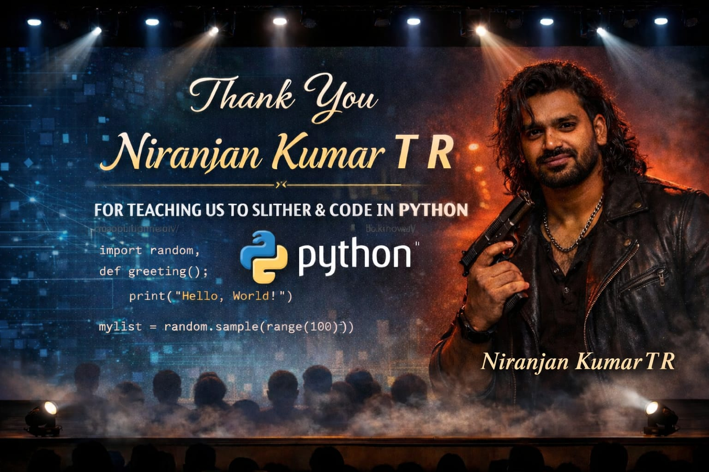

# 🐍 Python Teacher Celebration Website

A premium, interactive tribute website built to celebrate an inspiring Python teacher, **Niranjan Kumar T R**. This project combines modern web design with Python-themed aesthetics to create a unique digital thank-you card.



## ✨ Features

-   **🐍 Python-Themed UI**:
    -   Dark mode design with Gold & Code-Syntax accents.
    -   Section titles styled as Python functions and classes (e.g., `def memories():`, `class Mentor(Teacher):`).
    -   Floating background symbols (`{}`, `#`, `def`) for an immersive coding atmosphere.

-   **🎥 Interactive Multimedia**:
    -   **Video Tribute Grid**: A dedicated section to showcase tribute videos in a sleek vertical layout.
    -   **Masonry Gallery**: A responsive photo gallery of 22+ memories that glow on hover.
    -   **Typing Effect**: Hero subtitle types itself out like a terminal command.

-   **🚀 Modern Animations**:
    -   **3D Tilt**: Cards and video containers have a 3D tilt effect on hover.
    -   **Scroll Reveal**: Sections fade in smoothly as you scroll.
    -   **Live Stats**: Animated counters for "Students Inspired" and "Lines of Code".
    -   **Confetti**: A celebratory burst of confetti on page load!

## 🛠️ Tech Stack

-   **HTML5**
-   **CSS3** (Variables, Grid, Flexbox, Animations)
-   **JavaScript** (Vanilla JS + Canvas Confetti)
-   **Google Fonts** (Cinzel, Inter, Fira Code)

## 🚀 How to Run

1.  Clone this repository.
2.  Open `index.html` in your browser.
3.  Enjoy the celebration!

## 📂 Project Structure

```
teacher-celebration/
├── assets/             # Images and Videos
├── index.html          # Main HTML structure
├── styles.css          # All styling and animations
├── script.js           # Logic for interactions and effects
└── README.md           # This file
```

## ❤️ Credits

Made with love by the students of **Niranjan Kumar T R**.
*Thank you for teaching us to slither and code!*
